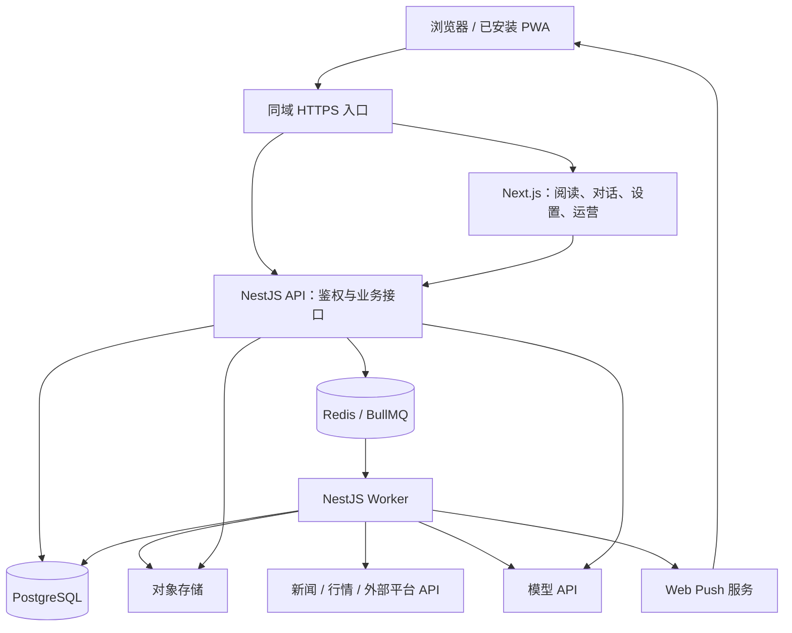

# 产品需求方案的架构方案

本文依据用户提供的《SIFT 产品需求文档》（`product-requirements.md`，更新于 2026-09-16），对应[产品文档 PR](https://github.com/DigitalLabs-web3/SIFT-docs/pull/1)。架构核对依据是提供的文件；该文件引用的 ADR 和研究文档未作为已核实的补充需求。技术资料核对日期为 2026-09-18。

本方案保留产品要求的动态精选、事件聚合、外部来源同步、四层个性化、异动检测与更正通知，**不以每日简报替代动态精选，也不把明确要求的能力从架构中省略**。与当前 Sift 设计对应的架构另见[另一份方案](architecture-sift.md)。

核心选择是：**一个 TypeScript 仓库，Next.js + PWA 前端，NestJS 模块化后端；公共信息可复用，个人导入和推断严格按用户隔离，模型生成结果必须经过业务规则才能生效。**

## 1. 范围与技术决策

主导航为精选、探索、行情、我的。探索只有“为你 / 全球热点”两个频道，其余条件进入筛选。Agent 提供解释和方向性判断；当前范围不包含交易、价格提醒、信息追踪、投资复盘或收费分层。

| 决策 | 建议及原因 |
| --- | --- |
| 服务结构 | NestJS 模块化单体，API 与 Worker 分进程；模型任务、行情处理和同步任务分队列，避免互相阻塞。 |
| 数据与任务 | PostgreSQL + Prisma 保存业务记录；Redis + BullMQ 执行任务；对象存储保存许可范围内的原文、译文和媒体。 |
| 前端 | Next.js App Router + PWA；同一应用提供用户页面与受权限保护的最小运营后台。 |
| Agent | NestJS `AgentService` + AI SDK，模型供应商可替换。首版不默认采用 DeepSeek Harness。 |
| 个性化 | 明确关系、短期信号、确认记忆分别保存；代码决定作用范围，模型只辅助理解表达。 |
| 搜索与事件 | PostgreSQL 内先做关键词、别名、事件与权限过滤；跨语言语义召回需要时使用 pgvector，不先上独立搜索平台。 |
| 通知 | 数据库保存站内通知，Web Push 尽力送达；PWA 不能承诺所有设备都有原生 App 一样的通知能力。 |

这是面向完整 PRD 的架构建议，尚未落地。现有 React + Vite Demo 可提供交互组件、样式和测试样例，但不能直接视为这套后台已经实现。

## 2. 整体结构与代码组织



Next.js 提供页面，`/api/*` 由同域入口转发给 NestJS。前端和 Next.js 服务端渲染都通过后端接口取数，不直接访问数据库。个人信息接口、服务端页面缓存和浏览器缓存统一按身份处理，不能复用其他用户的结果。

```text
apps/
  web/                         # Next.js、PWA、运营页面
  server/
    src/
      main.ts                  # HTTP API、流式对话
      worker.ts                # 后台任务，复用模块
      modules/
        identity/
        content/               # 来源、发布、事件、证据、语言版本
        connectors/            # 个人来源授权与同步
        discovery/             # 精选、为你、全球热点、搜索
        personalization/       # 明确偏好、短期信号、确认记忆
        market/                # 资产、行情、异动规则
        personal/              # 收藏、阅读、关注、自选
        agent/
        notifications/
      infrastructure/
    prisma/
packages/
  contracts/                   # API 与流事件的 Schema / TS 类型
docs/
```

用 pnpm workspaces、统一锁文件和 CI 即可。NestJS 模块间直接调用服务，不把每个模块部署成独立服务。业务数据只由所属模块修改，队列传记录 ID 和处理版本，不把全文与凭证复制到每个任务。

## 3. 数据与权限边界

PRD 的四个内容池是四种业务边界，不需要四套数据库。

| 数据组 | 主要记录 | 必须保证的规则 |
| --- | --- | --- |
| 公共和个人材料 | `Publication`、`ContentAccess`、`Connection` | 材料具有公共或用户访问范围；个人同步不自动取得公共传播资格。 |
| 来源与认证 | `Source`、`SourceRating`、`IdentityReview` | A/B 来源等级、账号认证和单条事实状态独立，不相互代替。 |
| 事件与卡片 | `Event`、`EventMembership`、`CardVersion`、`ClaimEvidence` | 报道、观点、市场信号保留类型；卡片陈述指向具体证据版本。 |
| 语言与历史 | `Representation`、修订 / 更正 / 转载关系 | 译文是派生表达；原生稿独立，历史版本不被新稿覆盖。 |
| 精选与阅读 | `SelectionDeck`、`DeckItem`、`ReadRecord` | 卡组有限、刷新可复现；记录滑过卡片和实际打开的来源版本。 |
| 个性化 | `Preference`、`InterestSignal`、`MemoryCandidate`、`ConfirmedMemory` | 明确选择、临时推断和确认记忆分别管理，均可解释来源。 |
| 行情与异动 | `Asset`、`MarketBar`、`AnomalySignal` | 记录市场、周期、基准、计算规则版本和数据时间。 |
| Agent 与通知 | `Conversation`、`Message`、`Judgment`、`Citation`、`Notification`、`Delivery` | 历史回答不变；通知事件与设备送达状态分开。 |

`ContentAccess` 表示授权和可见性，不是用户兴趣。首版即使相同公开帖子被两个用户导入，也保持各自授权关系；物理去重不能导致私人材料、摘要、向量、事件数量或推荐理由跨用户泄露。公共来源必须经过独立接入流程。

公共事件只用公共材料生成公共陈述。个人材料可关联公共事件用于本人阅读，但其新增事实和总结放在个人范围；不要把私人证据写进公共卡片。列表、搜索、模型工具、通知、导出和对象下载均执行同一访问检查。

发布正文与卡片版本不可静默改写。使用类型化 `ContentRef` 记录事件、卡片版本和实际阅读材料 / 译文版本；更正新增记录并建立关系。授权撤回、质量下架、链接暂不可用和普通归档保存不同状态，正文是否留存服从授权。

## 4. 内容处理、事件聚合与多语言

### 4.1 公共内容链路

1. 采集供应商、官方来源和准入的财经真人观点，保存原始标识、来源、语言、发布时间、接收时间及许可。
2. 识别类型、资产、主题和传播关系。作者身份不能把观点自动变成事实；转载和译文不增加独立证据数。
3. 按主体、事项、时间和资产召回候选事件，再核对是否同一件事。无法可靠关联时作为独立信息保留，不为去重强行合并。
4. 生成卡片所需陈述、关键事实、影响范围和证据链接。来源等级、重大程度、事实状态分开记录；无充分材料时不生成确定结论。
5. 通过结构校验、数字及时间核对、冲突检查后发布版本。高风险歧义进入人工核对，尚未完成整理的材料按其可用状态展示，不伪装成完整确认卡。

“已确认事实”落实到陈述与证据：一个 A 级原始文件或两个独立可靠来源一致，还要检查是否只是在转述同一人的主张。公司公告保留“公司称”等归因。独立性和主张归属不能仅用来源数或模型信心判断。

AI 生成字段保存处理版本和引用，卡片统一显示一次 AI 整理标识。AI 自己提出的投资观点只留在对话中，不作为独立信息进入精选、为你或全球热点。模型失败时不能用无依据的默认方向补齐卡片；哪些字段缺失仍可进入精选，需要在卡片发布规则中确定。

所有任务按至少一次执行设计。业务事务内写待处理事件，派发到 BullMQ；幂等键包含材料版本、访问范围、任务类型及配置版本。翻译、事件处理和卡片发布可以分别重试，避免失败后整批重复调用模型。[NestJS 队列文档](https://docs.nestjs.com/techniques/queues)提供采用 BullMQ 的集成方式。

### 4.2 多语言阅读

事件 ID、卡片 ID 和阅读稿件 ID 分开。切换语言不重排当前事件列表；新打开事件时，可从有权限的目标语言原生稿中选择代表；已打开页面保留当前材料，提示用户主动切换。没有原生稿才翻译当前版本，未完成时保留原文与处理状态。

译文按“原始发布版本 + 语言 + 翻译配置版本”复用，记录生成方和对应原文；财报数字、币种、单位、引语和代码有专门核对。报告翻译问题进入内容核对任务。原生稿与译文存在事实差异时，不得当成可互换的同文表达。

检索先做中英文资产代码、名称与主题别名，再评估跨语言向量召回。结果按有权访问的事件聚合，代表稿的语言选择发生在事件确定后，不能用语言过滤丢掉重大消息。无需为每种语言建设一套内容池。

## 5. 精选、探索和个性化

### 5.1 动态精选卡组

精选有独立的列表状态，但没有独立内容池。`SelectionDeck` 保存用户、卡组修订号和 10–20 张卡的顺序、版本、加入时间与已读状态；数量不足时不凑数。

刷新在事务中完成：保留未读卡 → 计算合格的新候选 → 淘汰已读且优先级低的卡 → 保存新卡组版本。请求携带卡组修订号，两个设备并发刷新时重新计算，不能用旧列表覆盖新阅读状态。滑过产生幂等已读事件，不产生正向或负向兴趣。

初始排序结合公共影响力、明确关系、时效、来源与证据。运营调整必须有原因、操作者和到期时间。新有效更正版替代默认旧卡，历史仍能打开；用户正在阅读时只提示更新，不替换正文。

“20 张全部未读且有重大新消息”无法同时满足全部保留和立即加入，需先明确满额规则。建议维持上限与未读稳定，提示有新增并引导探索；如要求重大消息立即进入，应明确可替换规则，不在实现中偷偷突破限制。

### 5.2 各入口的候选与排序

- **精选**使用重要性与明确关系，不把短期推断混入；个人导入财经内容是否可入选尚待确认。
- **为你**使用公共内容及本人可用的财经导入内容，叠加明确偏好、短期兴趣和有效确认记忆。
- **全球热点**保留公共事件与公共基础顺序，不受个人导入或兴趣信号改变。
- **已关注筛选**只使用自选、主题、作者和来源的明确关系，不能把推断当成关注。
- **搜索**查询公共与本人可访问的材料，按事件聚合，再提供资产、作者和来源结果。

授权、静音和内容准入先于排序。重大程度不能绕过这些边界。推荐理由指明是主动关注、近期询问还是确认记忆，不能把推断说成用户设置。

### 5.3 四层信号与记忆

明确偏好、关注和自选由普通写接口维护。阅读与对话产生的候选信号由后台处理，记录原始行为 / 用户表达、对象、限定条件、可信程度、发生时间和作用范围；信号失败或不确定不阻塞阅读与回答。

模型理解完整对话，但偏好证据只允许来自用户自己的表达，需区分提问、引用、假设、纠正和操作请求。对“不想看 NVDA 日内波动”保留资产、信息类型与周期的组合范围；无法表达时不扩大成屏蔽 NVDA。

短期信号按 `weight × 2^(-ageDays / 7)` 衰减，30 天后失效并清理；新行为单独计时。显式偏好优先，短期信号只影响“为你”。“重置近期推荐”同时清除信号、使排序缓存失效，并记录处理水位，防止排队中的旧任务又写回被清除信号。

确认记忆经过“候选 → 用户修改 / 确认 → 生效”，支持暂停和删除。保存可解释文字及支持的结构化作用范围；需要开放表达的部分只用于 Agent 上下文，不能假定任意一句话都能精确变成推荐过滤器。暂停 / 删除立即影响检索与生成，并保留最小抑制记录，防止旧对话重新生成相同记忆。

负反馈立即隐藏当前信息并生成可撤销的短期影响，按事件身份去重，不能把同稿转载当成多次反馈。重复反馈扩大到主题的次数、有效期和提示方式尚未确定，首版不凭模型自行扩大。

## 6. 外部来源连接与删除

X、知乎等平台分别通过服务端连接器接入。OAuth / 平台授权凭证加密存储，不进入浏览器、日志或模型提示；同步使用游标、限流、去重和重试，只取获准访问的关注列表、公开内容与公开话题。

**平台是否提供所需接口和许可，是实施前置条件。** 不能把“公开可见”当成可批量读取、长期缓存或商业展示的授权，也不能预设所有平台都能读取关注关系。不满足条件的平台应标为暂不支持，不能用模拟数据宣称已接入。

连接状态区分有效、授权失效、已断开。断开先停止新同步并撤销可撤销的凭证；按用户选择保留或删除已同步数据。保留不表示仍有持续访问资格，能否继续进入推荐需遵循授权与确认后的产品规则。

删除任务沿材料依赖清理正文、摘要、译文、向量、个人事件表达、推断主题与缓存，立即使查询不可见，再完成物理清理。排队同步任务需检查连接状态与删除水位，不能把数据重新写回。用户明确偏好、自选和确认记忆按 PRD 保留，但不能借此永久保存本应删除的来源全文；受影响的引用显示不可用，衍生回答的保留范围另行确认。

## 7. 行情、异动和更正通知

### 7.1 异动检测

行情 Worker 保存可回测的时间序列，按交易所日历、交易时段、拆股调整、币种和供应商口径计算 15 分钟 / 1 小时指标。加密资产连续交易与股票交易时段分别处理，使用 Decimal 计算金额与比率，不依赖二进制浮点直接核对财务数字。

PRD 的“过去 30 天同周期绝对变动第 95 百分位，或相对成交量 2 倍”作为待验证配置保存，绑定规则版本。基准只使用当时可获得的历史数据，缺足够样本、低流动性、停牌或异常报价时暂停触发。回测需要统计误报、重复触发与不同市场表现，不能直接把初始门槛当作已验证算法。

`AnomalySignal` 保存资产、观察窗口、指标、历史基准和数据来源。代码计算触发，模型只辅助解释；关联新闻不足以证明原因，原因状态必须允许“可能解释 / 未知”。同资产相邻窗口的合并和冷却规则待验证，避免持续波动生成大量重复卡片。该能力不生成价格提醒或交易指令。

### 7.2 信息更正

更正流程是：接收新材料 → 核对旧陈述实际受影响范围 → 发布更正版并连接旧版 → 查找读过受影响卡片 / 材料的用户 → 创建站内通知 → 尝试推送。只针对结论、关键数字或影响方向的实质变化，不为普通措辞调整通知。

引用关系用于找出待核对对象，不代表所有引用者都必然有错。旧回答保留正文和生成时间，附“信息已变化”提示，用户选择后才重新分析。

通知唯一键按用户与更正事件去重；站内通知是可查询记录，推送成功与否单独记录，不把发送成功当成用户已读。取消授权或删除数据后，派发前再次检查访问权限。

PWA 推送需 HTTPS、用户授权与浏览器支持；iOS / iPadOS 上还涉及安装到主屏幕等条件，不能保证每个普通网页访问者都能接收。使用[Next.js PWA 指南](https://nextjs.org/docs/app/guides/progressive-web-apps)中的能力边界设计订阅和降级，未授权时仍保留站内通知。申请更正通知权限的时机需产品明确。

## 8. Agent 与引擎选择

### 8.1 业务问答流程

`AgentService` 依次执行：校验身份与预算 → 读取新闻 / 事件 / 异动 / 资产上下文 → 读取有效的用户选择与确认记忆 → 检索材料与行情 → 回答 → 生成适用的结构化判断 → 校验引用和必需字段 → 保存结果。

方向性判断保存方向、周期、依据、反证、风险、失效条件，以及主资产、数据时间和不确定性。无充分证据时不能为了卡片完整而补造看多 / 看空理由。不生成具体交易价格、仓位或订单。

模型可使用 `searchEvidence`、`getEvent`、`getPublicationVersion`、`getMarketWindow` 等受控只读工具；每次调用执行服务端权限与许可检查。加入自选、关注或保存记忆只生成操作建议，用户点击后由常规 API 写入，模型工具不直接执行。

正文、引用和判断先校验再标记完成。自然语言可以流式展示，未完成判断卡不提前当作正式结论；失败时保留失败状态与可用回答，避免自动重试覆盖旧消息。前端通过 fetch 消费同域 HTTP 流；用运行 ID、请求幂等键和完成状态支持断线查询，取消请求同时传播到模型调用。

每轮设置工具步数、材料数量、超时、token 与费用上限，记录模型、提示版本和取用证据。工具参数 Schema 只能验证格式，不能证明财经判断正确；上线前需要包含数字、反证、否定与来源冲突的人工核对样本。

### 8.2 推荐 AI SDK，保留可替换边界

推荐采用 **AI SDK 的受控工具循环运行在 NestJS 内**。简单抽取、翻译、分类和兴趣候选生成使用固定步骤；后台调度归 BullMQ，不让 Agent 自己决定同步、发通知或改变用户状态。AI SDK 官方提供[Agent 与循环控制](https://ai-sdk.dev/docs/agents/loop-control)，并可通过[DeepSeek provider](https://ai-sdk.dev/providers/ai-sdk-providers/deepseek)调用模型。

DeepSeek 模型与 DeepSeek Harness 是两个选择。Harness 提供可组合的 Agent 运行机制，但[官方安全说明](https://github.com/deepseek-ai/deepseek-harness/blob/master/SAFETY.md)明确其开发预览和未审计状态；[默认 SDK minimal 组合](https://github.com/deepseek-ai/deepseek-harness/blob/master/packages/bundle/sdk-minimal/README.md)面向编码任务，不能直接作为多用户资讯服务上线。

本方案更不宜让 Harness 自带会话或记忆承担业务主记录：个人授权、推断衰减、用户确认、删除和更正都有独立规则。即使试用，也只替换模型运行适配器，移除通用 Shell / 文件工具，保留 NestJS 的权限、存储与状态控制，并验证取消、费用、引用和多用户隔离。

只有出现需要跨请求暂停、多分支恢复的 Agent 任务，才考虑 [LangGraph.js](https://docs.langchain.com/oss/javascript/langgraph/overview)的持久化执行能力。PRD 功能多，并不自动意味着每个业务流程都需要 Agent 图或多 Agent 协作。

## 9. 接口、PWA 与运行保障

主要 API 按业务对象组织：`/api/selection` 返回卡组修订号；`/api/feed` 与 `/api/search` 返回稳定游标；`/api/events` 与 `/api/publications` 区分事件和指定材料；`/api/connections`、`/api/preferences`、`/api/memories`、`/api/notifications` 管理各自状态；`/api/conversations` 管理对话与生成。

登录后使用安全 Cookie，写请求校验 CSRF / Origin。游客可浏览公共页面，本地保存选择；连接来源、跨设备同步和确认记忆云保存需登录。游客合并使用幂等迁移，明确选择不能被默认值或推断覆盖，冲突记忆不自动合并为相反含义。

PWA 缓存静态壳和获准缓存的公共资源。个人 API、对话和私人导入内容默认不进入 Service Worker 缓存；退出登录清理本地个人状态。手机关闭后，采集、兴趣到期、异动与通知仍由服务器处理，不能依赖浏览器后台任务。

首版使用一个区域的 Next.js、NestJS API、Worker 与托管存储。后台至少区分同步 / 内容处理、行情规则、模型处理、通知队列，分别限制并发；先用同一 Worker 程序，真实压力出现后按队列部署多个 Worker。Redis 可恢复的缓存与不可随意淘汰的任务数据需区分生命周期，业务状态仍以 PostgreSQL 为准。入口代理关闭对话响应缓冲，超时与模型运行上限匹配。

运营后台需要来源审核与评级、账号认证记录、事件误关联拆分、陈述 / 更正核对、限时精选干预、翻译问题和失败任务处理。每次人工修改留操作者、原因和时间；这部分是产品能力的维护成本，不能只做面向读者的页面。

上线前验证备份恢复、迁移回滚兼容、密钥管理、供应商限额与模型成本。重点测试：私人内容不跨用户；短期兴趣不进入已关注；重置后旧任务不恢复信号；断开后同步不复活；滑过不成为兴趣；刷新保持未读；翻译不增加证据数；重大更正通知不重复；行情缺失不误报。日志以记录 ID 和处理状态为主，不默认保存完整隐私提示或凭证。

## 10. 产品需要澄清或调整的地方

以下是实现前需要确认的问题，并非已批准的需求修改。顺序按对数据模型和主流程的影响排列。

| PRD 位置与问题 | 建议处理 |
| --- | --- |
| §1.3、§6.6：未读满额与补入重大新消息冲突 | 明确满额时保留、替换还是临时超额。建议维持上限和未读，新增先进入探索；若必须突破，明确仅重大消息的例外。 |
| §1.6：所有回答固定附判断卡，解释型问题并不一定涉及方向 | 建议仅方向性分析附完整判断卡；普通解释保留依据和不确定性。若必须始终显示，字段应允许“不适用”，不可强制生成方向。 |
| §2.1：没有主资产也显示“分歧”，混合了不适用与观点冲突 | 建议区分“影响不明确 / 不适用”和真正的分歧；主资产与观察周期应成为判断前提。 |
| §1.9：A/B 等级与“可靠且独立”仍缺操作标准 | 明确来源评级审批、转载识别和主张核对规则；来源声望不能自动确认其转述的事实。 |
| §1.12：X、知乎的授权能力被假定可用 | 开发前验证接口、权限、配额与使用许可；逐个平台承诺支持范围。不可把连接按钮完成当成同步能力完成。 |
| §6.3、§6.4：个人财经内容是否进入精选不明确 | 建议首版精选只用公共合格候选；若允许私人候选，必须在卡组、事件与通知中贯穿用户权限，不能影响公共排序。 |
| §5 与 §7：近期行为可改变内容市场，但短期兴趣又只影响为你 | 建议近期行为产生的市场权重也只用于为你；精选用明确关系，全球热点维持公共基础顺序。 |
| §1.12、§6.7：断开可保留已有数据，但授权失效又影响候选资格 | 明确保留后是仅可查阅历史，还是继续参与推荐；删除还需覆盖译文、向量、衍生表达和缓存，说明旧回答保留范围。 |
| §1.9、§1.19：更正通知属于当前范围，但权限时机和“读过”口径未定 | 明确滑过是否也需要通知、更正影响范围与申请时机。站内记录兜底，Web Push 不承诺必达。 |
| §2.2：异动门槛尚未回测 | 确定支持资产、历史样本、交易时段、最低流动性、异常点处理和冷却策略；先回测，再进入正式精选。 |
| §5.2 与 §5.6：语言切换和原生稿替换的表述有差异 | 按更明确的验收规则：当前正文固定，只提供主动切换；下一次正常打开才优先原生稿。保存实际阅读版本。 |
| §7：自由文本记忆和精细反馈缺少可执行范围 | 定义首版支持的资产、类型、周期等条件；无法表达时不扩大作用域。确认记忆冲突、重复负反馈门槛和删除抑制规则需补齐。 |
| §1.16、§2.1：要求站内直接读原文，但部分来源可能不允许全文或嵌入 | 许可不足时摘要加原文链接；普通 PWA 不能保证第三方站点允许 iframe 嵌入。明确全文体验取决于采购覆盖。 |

## 11. 实施顺序与复杂度控制

1. **验证前置条件。** 确认数据许可、外部平台接口、异动历史数据和推送可达范围，解决精选满额与判断卡语义问题。这些决定不能靠后补接口解决。
2. **建立公共阅读链路。** 完成仓库、身份、内容版本、事件与证据、动态精选、探索、搜索、基础行情和多语言阅读；配套最小运营后台。
3. **接入 Agent 与个性化。** 完成有依据的回答、适用的判断卡、短期信号、确认记忆、重置与撤回，先用少量人工核对场景验收。
4. **完成外部同步、异动与通知。** 在已验证的数据和权限条件下接入，覆盖断开删除、重试、回测、读者定位与推送降级；再进行整条链路验收。

这些是开发批次，不是删减 PRD 的验收范围。相较当前 Sift 设计，额外工作主要来自持续同步、个性化状态生命周期、行情规则验证以及更正通知的端到端可靠性。先复用一套数据库、版本、权限和任务机制，再按实际压力扩容；减少的是重复实现和基础设施数量，不能省掉这些功能各自必须承担的规则。
