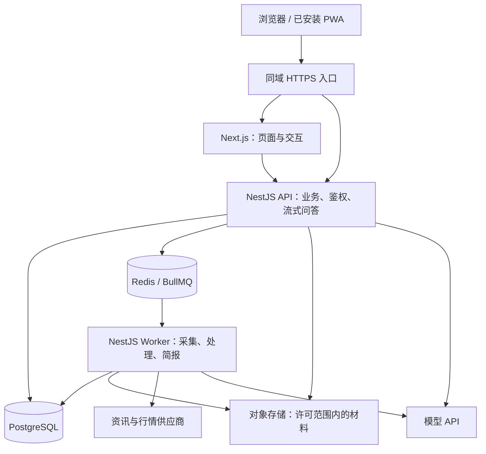
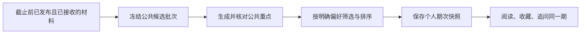

# Sift 当前设计的架构方案

本文依据[产品设计](product-design.md)和[内容规则](content-rules.md)，描述从现有 Demo 走向可运行产品的建议架构。技术资料核对日期为 2026-09-18。文中的默认做法是架构建议，尚未确定的产品规则集中列在末尾。

核心选择是：**一个 TypeScript 仓库，Next.js + PWA 前端，NestJS 模块化后端；内容处理在后台复用，阅读请求保持轻量，AI 只承担需要理解和生成的环节。**

## 1. 范围与主要决策

本方案服务“简报 → 探索与依据 → 上下文追问”的阅读路径，包含来源内容、事件与专题、每日简报、行情、自选、明确偏好和个人记录。不引入外部账号内容同步、行为兴趣推断、长期记忆、异动检测或更正推送。

| 决策 | 建议及原因 |
| --- | --- |
| 应用结构 | NestJS 模块化单体，API 与后台任务分进程运行。先隔离慢任务，无需拆成微服务。 |
| 数据 | PostgreSQL 保存业务事实，Prisma 管理访问与迁移；Redis + BullMQ 执行异步任务；对象存储保存获准留存的原文和媒体。 |
| AI | NestJS 内的 `AgentService` 使用 AI SDK，按需调用 DeepSeek 等模型；首版不依赖 DeepSeek Harness。 |
| 推荐 | 资格筛选与可解释规则排序，公共候选复用；不为每次列表访问调用模型。 |
| 简报 | 公共重点先生成，按用户明确选择组装并冻结一期，避免按用户重复生成相同文字。 |
| 搜索 | 先在 PostgreSQL 内做关键词、别名和过滤；语义召回有实际收益后再加 pgvector，不先部署独立搜索集群。 |

当前仓库是 React + Vite 的交互原型。已有页面、样式、内容样例和规则测试可以复用，浏览器本地状态与模板回复需要逐步替换；本方案不表示已经完成 Next.js 或后端迁移。

## 2. 整体结构与仓库



对外保持一个域名，`/api/*` 路由到 NestJS，其余由 Next.js 提供。Next.js 负责渲染和客户端状态，业务写入、权限检查、模型调用均经过 NestJS，不在 Server Actions 中再实现一套业务后端。登录态页面和接口不进入共享缓存。

建议仓库结构：

```text
apps/
  web/                       # Next.js App Router、PWA、管理页面
  server/
    src/
      main.ts                # HTTP API
      worker.ts              # 后台任务入口，复用业务模块
      modules/
        identity/
        content/
        discovery/
        briefing/
        market/
        personal/
        agent/
      infrastructure/        # 数据库、队列、供应商适配
    prisma/                  # Schema 与迁移
packages/
  contracts/                 # 请求、响应与流事件的 Schema / TS 类型
docs/
```

使用 pnpm workspaces 和统一锁文件即可。`contracts` 只共享接口契约和运行时校验，不把数据库实体、密钥或 NestJS 内部服务带到浏览器。纯业务规则先留在后端，需要实际复用时再提取包。

## 3. 模块职责

| 模块 | 负责什么 | 边界 |
| --- | --- | --- |
| Identity | 账号、会话、访问身份、管理员权限 | 登录方案待确认，不自行建设复杂账号体系。 |
| Content | 来源、发布记录、重复关系、整理版本、引用、使用权限 | 来源内容可先发布，整理失败不阻塞阅读。 |
| Discovery | 关注、推荐、热点、专题、搜索 | 共用内容库，各入口明确筛选与排序规则。 |
| Briefing | 截止批次、公共重点、用户期次 | 已发布文案、顺序和引用不随刷新改变。 |
| Market | 资产目录、行情快照、历史图表、明确资产关系 | 自选不是持仓，内容关系不是价格因果。 |
| Personal | 关注、自选、偏好、收藏、浏览历史 | 不根据阅读和对话自动推断长期兴趣。 |
| Agent | 会话、引用上下文、受控工具、模型运行记录 | 模型不直接修改收藏、偏好或内容库。 |

少量管理页面放在同一 Next.js 应用，通过 NestJS 管理员权限访问：维护来源与主题、核对重复关联、发布或撤下整理、附加错误说明、查看失败任务。不另建通用 CMS 或工作流平台。

## 4. 数据模型：统一阅读，保留版本边界

“内容”是统一接口概念，不意味着所有对象都放在一张大表。公共列表返回相同的卡片结构，持久化按不同生命周期划分。

| 数据组 | 关键记录与约束 |
| --- | --- |
| 来源与材料 | `Source` 是完整发布身份；`Publication` 是某次发布或修订，保存来源、外部标识、发布时间、接收时间、正文摘要与许可状态。正文版本不可覆盖。 |
| 来源内容 | `SourceContent` 是逻辑阅读对象；等同发布关系绑定具体 `Publication`，修订链与转载关系分开。允许撤销误关联。 |
| 综合整理 | `Collection` 区分事件和专题；`CollectionVersion` 保存文字与截止时间；`Evidence` 直接指向发布记录及主要依据、背景、观点角色。 |
| 简报 | `BriefingBatch` 固定候选与截止时间；`Highlight` 保存公共重点和准确引用；`UserEdition` 保存个人期次的重点文字、顺序、选择版本和引用。 |
| 派生表达 | `Representation` 记录某个版本的摘要、翻译或清洗结果，以及语言和生成版本。更正译文新增版本，不覆盖历史阅读表达。 |
| 资产与分类 | `Asset`、`QuoteSnapshot`、历史行情；主题使用小型平面词表；内容与资产关系区分主要对象和背景。 |
| 个人记录 | 关注、自选、偏好版本、收藏、浏览记录；收藏和历史使用包含对象种类与具体版本的 `ContentRef`。 |
| 问答与处理 | `Conversation`、`Message`、`Citation`、`ModelRun`；处理任务保存输入版本、状态和幂等键。 |

关键约束放在数据库与服务代码中：同一来源外部发布版本不得重复入库；用户一期只有一个已发布快照；引用必须定位现存且有权访问的版本。JSON 适合保存结构化生成结果和快照，不替代引用关系与权限字段。

例如，A 发布报道第一版，B 原样转载，随后 A 更正月份：保留 A1、B1、A2 三条发布记录；A1 与 B1 的等同关系保持不变，A2 修订 A1。列表可以展示 A2，收藏 B1 仍打开 B1，引用 A1 的专题不会自动变成引用 A2。

“不可变”指不静默改写历史事实，不代表必须永久保留全文。授权撤回时移除不允许继续保存的正文、译文及缓存，保留许可允许的身份、状态和引用占位。

## 5. 主要处理流程

### 5.1 资讯接入与综合整理

1. 供应商适配器拉取或接收内容，核对标识、时间、正文完整性与使用许可。按来源发布版本建立幂等键。
2. 原始记录入库，执行可靠标识、转载关系和完整正文一致性检查。语义相似只生成待核对建议，不直接折叠存在关键差异的报道。
3. 合格来源内容立即可读。分类、翻译、关联和综合整理在后台继续执行，不让模型队列拖慢资讯可见时间。
4. 用资产、时间和对象缩小候选，再判断事件关系。模型只在指定材料中生成陈述和引用；代码验证引用有效、关键数字与材料对应，歧义进入人工核对。
5. 发布整理版本，保存输入记录、模型与提示版本。新材料只触发相关整理的检查，不重算全库。

数据库事务同时写入待处理事件，再由派发器送入 BullMQ，避免“入库成功但任务丢失”。按至少一次执行设计：任务可重试，但同一输入版本与处理配置只发布一次结果。失败任务有次数上限和人工重试入口；数据库保留处理状态，Redis 不承担唯一业务记录。[NestJS 官方队列集成](https://docs.nestjs.com/techniques/queues)支持这里采用的 BullMQ 工作方式。

### 5.2 推荐、搜索与行情

推荐先执行内容可见性、排除条件和临时筛选，再结合重要性、自选、明确兴趣、关注来源与新鲜度排序。同一主题的多个匹配不反复加分；整理与主要材料适度去重，尚未纳入的新进展继续展示。

每个候选携带一条由实际关系计算的理由：自选、兴趣、关注来源，或“重要信息 / 拓展视野”。理由由规则生成，模型不临时编造推荐原因。来源排除使整理依据失效时，排除整项整理，不抽走依据后继续展示原结论。

关注、公共热点、自选热点和主动搜索有各自范围，不能把推荐排除误当成通用访问权限。访问权限和内容使用许可则对所有入口一致生效。

搜索先覆盖标题、摘要、来源名称、资产代码与中英文别名。中文分词和跨语言别名需要独立验证，不能直接假定 PostgreSQL 默认英文全文检索能覆盖。语义检索如有必要，先在同一数据库增加向量字段；检索、缓存和引用都保留访问过滤。

行情按供应商批量接入并复用缓存，保存单位、比较周期、市场状态、数据时间与延迟属性。页面前台按许可频率刷新，后台不为每个用户重复拉取同一资产。历史图表采用供应商历史接口或已保存的聚合点；缺数据时显示缺失，不用连线伪造连续行情。

### 5.3 每日简报



建议首版使用一个平台出刊时区与固定截止时间，不按用户定制发布时间。后台冻结公共批次，用户首次请求本期时组装个人期次，使用唯一约束处理多设备并发。个人选择快照按首次组装时确定，之后的偏好变化用于下一期；该规则需产品确认。

资格要求不仅是 `publishedAt <= cutoff`，还包括截止前已经接收、可用。晚到材料进入后续批次，不能回填旧期次。公共重点失败时可退回获准摘录和链接；没有合格材料时明确本期未生成，不凑数。

语言切换只改变同一期的表达，不重选材料；派生译文也按版本保存。当前阅读理由独立计算，不伪装成当初选入的原因。重要错误只给实际重复该错误的重点附说明，不能把一条材料的更正自动广播到所有引用者。

## 6. Agent：问答能力与引擎选型

### 6.1 默认方案

推荐 **NestJS `AgentService` + AI SDK + 可配置模型供应商**。AI SDK 提供受控工具循环、流式输出等基础能力；简单摘要和分类使用单次结构化调用，追问才使用有限步工具循环。DeepSeek 模型可以直接通过 provider 接入，不要求采用 DeepSeek Harness。依据：[AI SDK Agent](https://ai-sdk.dev/docs/agents/overview)、[循环控制](https://ai-sdk.dev/docs/agents/loop-control)、[DeepSeek provider](https://ai-sdk.dev/providers/ai-sdk-providers/deepseek)。

问答流程为：鉴权与额度检查 → 读取会话初始上下文及指定版本 → 按需检索 → 生成回答与引用 → 校验并保存。初始上下文可以是来源记录、整理版本、简报期次或资产；“新对话”复制这个上下文，不复制旧消息，也不变成通用对话。

首版只提供 `searchContent`、`getContentVersion`、`getBriefing`、`getAssetQuote` 等只读业务工具。工具内部使用服务端用户身份校验访问，不接受模型指定用户身份，也不开放 SQL、Shell、任意网址抓取或任意文件访问。外部文章是待分析材料，其中的指令不具有执行权限。

代码设置最大步骤、单次和总超时、输入材料数量、输出 token 与用户预算。预算数值通过样例压测确定。引用需存在、可访问且指向实际取用版本；结构校验之外仍需抽样核对陈述，不能把“有引用”当作“结论正确”。

对话消息、引用、状态与运行成本保存在业务数据库。流式传输采用同域 HTTP 流，前端用 fetch 消费；断线后按运行 ID 查询结果，重试用请求幂等键避免重复提问。取消应终止可取消的模型请求；中断回答标记未完成，不当成完整答案。

### 6.2 DeepSeek Harness 是否适合

Harness 的插件、会话日志和可替换循环适合探索更开放的 Agent 能力，但不是现成的资讯业务后端。[官方核心说明](https://github.com/deepseek-ai/deepseek-harness/blob/master/packages/core/README.md)描述了这些可组合能力；[官方安全说明](https://github.com/deepseek-ai/deepseek-harness/blob/master/SAFETY.md)同时明确它是未经安全审计的实验性开发预览，不能视为生产就绪。

还需注意，[SDK minimal 默认组合](https://github.com/deepseek-ai/deepseek-harness/blob/master/packages/bundle/sdk-minimal/README.md)面向编码 Agent，默认带 Shell 和本地会话持久化。不能直接把这个组合接到面向用户的财经问答。

因此，本方案不把 Harness 作为首版依赖。如果要试验，只在隔离环境替换 `AgentService` 的运行适配器，提供相同的只读业务工具；账号、授权、会话主记录、引用和费用控制仍归 NestJS。先验证多用户隔离、取消、失败恢复、工具限制与引用质量，再决定是否值得承担适配和升级成本。

[LangGraph.js](https://docs.langchain.com/oss/javascript/langgraph/overview)适合需要持久化执行、暂停与恢复的复杂多步骤任务。当前问答和内容流水线已有明确边界，用普通业务函数与任务队列更直接，暂不需要额外引入图执行引擎。

## 7. 前端、接口与 PWA

Next.js App Router 对应简报、探索、行情、我的和内容详情。交互列表使用统一卡片契约，列表来源为普通文本；筛选、收藏和关注修改后由服务器返回最终状态。取消收藏后保留当前页面行属于客户端展示状态，数据库立即保存取消结果，再次进入按真实状态加载。

主要接口族：

- `/api/content`、`/api/content/:id/versions/:versionId`：发现与指定版本阅读。
- `POST /api/briefings/current`、`GET /api/briefings/current`、`GET /api/briefings/:editionId`：幂等组装本期、读取本期、读取固定期次。
- `/api/search`、`/api/assets`：搜索与行情。
- `/api/me/*`：明确偏好、关注、自选、收藏和历史。
- `/api/conversations/*`：创建上下文会话、提交消息、读取或取消生成。

修改操作使用明确的写接口和幂等语义；列表按稳定游标分页。接口返回对象种类、版本、显示时间和可用状态，前端不自行猜测“最新”或重建引用关系。

PWA 首版提供安装、应用图标和离线壳，按[Next.js PWA 指南](https://nextjs.org/docs/app/guides/progressive-web-apps)实现 Manifest 与 Service Worker。默认仅缓存静态资源，不缓存个人 API、模型回答或未经许可的全文；离线时明确不可更新。抓取、简报生成、模型调用和定时任务在服务器执行，不依赖手机后台存活。

## 8. 部署、质量与成本

先部署一个区域的 Next.js、NestJS API 和 Worker，使用托管 PostgreSQL、Redis 与对象存储。API 和 Worker 可以由同一后端镜像以不同命令启动。独立扩容 Worker 即可处理采集或模型积压，不先引入 Kubernetes、Kafka 或多服务调用链。入口代理需支持流式响应、关闭相应缓冲，并使超时与模型运行上限匹配。

身份由 NestJS 统一校验，浏览器使用安全 Cookie；写请求检查 CSRF / Origin，生成、搜索和登录接口限流。模型与供应商密钥只在服务器；个人数据查询必须带访问身份，日志不记录完整隐私对话。前端渲染清洗后的内容，禁止执行供应商 HTML 中的脚本。

CI 检查类型、规则测试、API 集成、关键页面流程和构建。迁移采用向后兼容的新增步骤，避免发布中旧 API 无法读新库；上线前验证数据库备份恢复。对象存储生命周期与来源授权一致。

优先验收：重复任务不重复发布；转载不增加证据数；更正不改旧收藏；截止后材料不混入旧简报；来源排除不留下失去依据的结论；两个用户无法读取彼此记录；模型失败不影响基本阅读。记录资讯可见延迟、整理积压、简报成功率、问答首字延迟与每批 / 每次模型成本，基于真实负载再设容量和服务目标。

## 9. 需要补齐的产品决策

以下问题不应由数据库或模型默认行为代替产品决定。

| 问题 | 建议默认做法与影响 |
| --- | --- |
| 账号与游客范围尚未定义 | 游客可读公共内容并本地保存选择；跨设备记录和持久化对话登录后启用。是否允许游客真实 AI 追问及其额度另定。它影响会话、同步和费用控制。 |
| 简报的出刊时区、历史补发与偏好生效点未定 | 一个固定出刊时区；首访本期时冻结个人选择；不根据今天的偏好补造未生成的历史个人期次。日期含义与当地显示时间需区分。 |
| 整理与重要性由谁负责 | 先选有限目录，明确一名可承担选题、核对和撤下职责的编辑角色。模型可以准备结果，不能代替运营责任。 |
| 同文识别与综合整理的可接受误差未定 | 先自动处理可靠重复，关键差异保守分开。建立人工核对样本，验证后再扩大自动发布范围。 |
| 偏好自然语言的表达边界未定 | 首版只支持已定义主题、来源和明确关系；保存前展示识别结果，无法表达的条件保留原文并提示，不偷偷扩大范围。 |
| 来源、翻译、图片与视频的授权未落实 | 先接入可覆盖目标阅读方式的少量供应商；按字段记录显示、缓存、翻译和历史保留权限。媒体缺授权时只提供允许的摘要与链接。 |
| 行情覆盖与刷新频率未定 | 延续美股、加密资产和商品范围，逐项确定供应商、单位、延迟与图表周期，不能把 Demo 快照当成实时数据承诺。 |
| 记录保留、删除撤销与清空范围未定 | 区分日常删除、短时撤销和彻底清除；Demo 的“重置示例数据”不进入生产功能。需确定服务器、对象和备份的实际删除期限。 |

## 10. 实施顺序

1. **先打通真实阅读。** 建立单仓库、Next.js 页面、NestJS API、版本化数据模型和一条资讯接入链；接入少量行情，完成来源阅读、搜索与个人选择。
2. **再完成有依据的理解。** 加入有限的事件 / 专题整理、固定简报、上下文问答和最小编辑后台；验证引用、错误说明与历史版本。
3. **最后验证可运营性。** 补齐授权撤回、失败重试、限额、备份恢复、PWA 和质量评估；根据真实结果调整排序、模型和处理并发。

实施过程中复用原型的交互与样例作为验收材料，但每完成一条真实数据链再替换对应演示状态，避免一次性重写全部页面。本文仅给出方案，不改变现有 Demo 的运行与部署方式。
