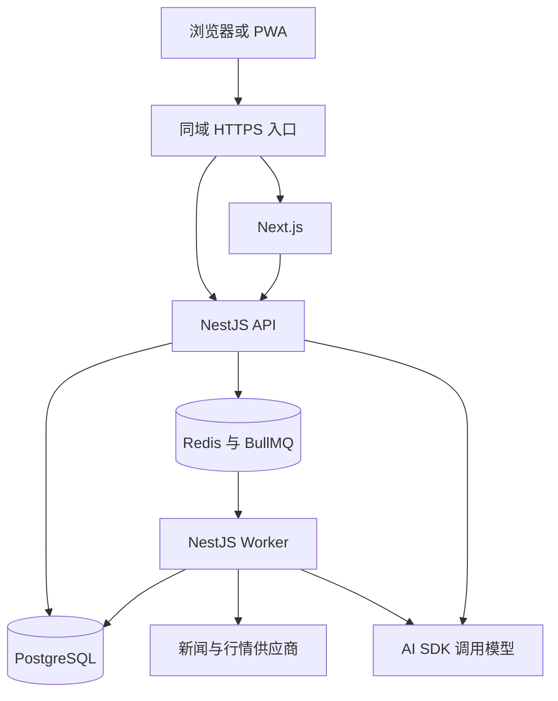

# news-draft 整体架构方案

面向“阅读 → 判断 → 复盘”，采用 TypeScript 单仓库：Next.js + PWA 负责页面，NestJS 负责业务，API 与后台 Worker 分进程运行。按需求收集信息、复用公开材料、由模型推荐，再用明确规则对照用户判断。

项目暂名 [news-draft](https://github.com/liuqiang1357/news-draft)，产品名称待定。产品依据为 [2026-09-30 版 PRD](https://github.com/DigitalLabs-web3/SIFT-docs/blob/2f1a97d05b791e52919bac828995f302d37cd350/product/docs/PRD.md)及其 ADR。本文是独立实施方案。

## 首版范围

主导航为阅读、复盘、我的。阅读包含资讯、异动和复盘卡，AI 作为上下文助手。兴趣为 AI 与科技、数字资产、美股、黄金、商业与消费；界面跟随系统语言，缺译回中文，使用一种视觉主题。

- 行情覆盖美股、数字资产和现货黄金，只对已接入标的的价格方向判断自动对照；其他笔记展示后续证据。
- 观察窗口为 1、3、7 或 30 天，休市顺延；比较方向并展示幅度，保留判断版本。
- 推荐允许异步刷新、缺类和少发；暂缓继续变化概率、具体价区和个性化仓位比例。
- 支持网页与 PWA 安装，首版不做推送、离线阅读或离线提交；个人背景先用数据库管理。

## 整体架构

### 系统职责



| 部分 | 职责 |
| --- | --- |
| Next.js | 页面、交互、PWA 和公开分享。 |
| NestJS API | 登录、权限、阅读、记录、收藏、偏好和流式对话。 |
| NestJS Worker | 收集、内容处理、批次预生成、行情检查和到期对照。 |
| PostgreSQL + Drizzle | 业务数据、版本、消息、任务状态和结果。 |
| Redis + BullMQ | 队列、限流和可恢复缓存。 |
| AI SDK | 提取、推荐、解释与工具调用。 |

浏览器 `/api` 由同域入口转发到 NestJS，Next.js 服务端也调用同一后端并传递身份。数据库和模型调用集中在后端。模型负责理解与解释，代码负责权限、计算、状态和调度，并校验模型输出。

### 核心数据

| 概念 | 含义 |
| --- | --- |
| 收集目标 | 公开主题或标的、来源、语言、时间范围及持续需求。 |
| 来源发布版本 | 一次发布及其出处、正文与时间；更正另建版本或关联记录。 |
| 卡片版本 | 资讯、异动或复盘的展示项，引用具体来源、行情或判断与对照。 |
| 阅读批次 | 用户的卡片顺序、推荐理由和生成上下文。 |
| 判断版本 | 用户原文、可选方向和标的、保存时间及版本。 |
| 观察与对照 | 判断版本、窗口、基准、终点、证据和计算规则。 |
| 个人背景 | 明确偏好与确认导入文本，区别于单次判断和短期信号。 |
| 会话与任务 | 所属用户、上下文、消息或结果及执行状态。 |

公开资讯与异动共享处理，个人判断、复盘卡、背景、会话和推荐按用户隔离。共享检索目标不包含私人原文，卡片也不重复存储判断与对照数据。

普通新闻候选默认有效 7 天，可按类型调整；过期且无引用、无处理任务的材料可清理。收藏和引用保留许可范围内的快照，来源失效仍显示记录与提示。发布时间、行情时间与获取时间分开保存，重新获取不算新发布。

标的使用内部稳定 ID，映射供应商标识、市场、币种和交易时段，避免同名证券、交易对或黄金报价混用。内容主题用于推荐，标的用于关联与价格对照。

## 阅读流程

信息按“收集 → 处理 → 推荐 → 批次展示”进入阅读流。

### 按需求收集

按活跃阅读、未结束观察和少量重要资讯需求收集。主题使用有限的公开查询模板，相同目标共用结果，兴趣为空用近期重要资讯；不维护全网候选池。

| 需求 | 新闻收集初始策略 |
| --- | --- |
| 新目标无近期结果 | 立即获取一次。 |
| 最近 24 小时有阅读 | 每 30–60 分钟补充。 |
| 有观察、无活跃阅读 | 每 3–6 小时补充。 |
| 无需求 | 暂停，有需求时恢复。 |
| 已知披露时点 | 发布后检查，有限重试。 |
| 刷新或下一批 | 复用结果，不足或过旧时补充。 |

频率按供应商、效果和成本调整。调度器扫描 `nextCheckAt`，队列优先增量获取，限制查询与翻页。普通笔记不创建永久轮询，回看时有限检索；观察完成或取消后结束需求，退出登录不取消观察。行情另按已支持的标的与数据能力安排。

### 内容处理

用来源标识、标准化链接和正文指纹去重；重复发布可合并展示但保留出处，不混合不同主张或更正。短分析与详情总结基于同一版本一次生成，区分事实与解读，只总结实际取得的材料。

来源等级表达出处可追溯性：A 为可核实的原始发布，B 为可追溯的二手报道，C 为原始出处尚未核实。保存理由，模型补充线索；等级不等于事实必然真实，意见与交叉证据单独展示。

### 个性化推荐

推荐从共享资讯、异动和本人的复盘结果中选择。代码先过滤无权限、过期、已读、重复和负反馈项，模型结合兴趣、背景与近期行为选择、排序并给理由；可补入重要信息或拓展视野内容。模型失败时按基础规则排序。

每批默认 6 张，可缺类、少发，不强制配比。已读卡 24 小时内不再推荐，同标的资讯默认 24 小时最多 3 张；当前队列与预取也去重。负反馈只影响后续批次，可手动恢复，默认 12 天衰减恢复。

### 展示与刷新

阅读左右滑切卡，顶部下拉刷新，批次末尾追加；预加载下两张，未读队列最多 30 张，满后停止追加。共用卡片、表单和状态组件，核心操作也能用鼠标与键盘完成。

有可用下一批返回 `200`；需生成时返回 `202` 和任务 ID。每个身份最多预取一批，重复刷新复用有效任务，合格结果足够时不等全部来源。

前端等待最多 5 秒后结束下拉动画，改为“仍在获取”；每 3–10 秒查询，隐藏时暂停，重进页面按 ID 恢复。区分有新批次、暂无更新和失败。用户接受后再替换未读队列或追加到队尾，后台完成不打断阅读。

新批次发布前复查偏好、权限与卡片资格，已接受批次保持稳定。批次版本和幂等键防止旧请求覆盖新状态，账号切换后丢弃迟到响应。

## 记录与复盘

### 登录与记录

游客可阅读和选兴趣，记录与对话须登录。主路径为同屏邮箱验证码，后端负责限流、验证码校验、HttpOnly Cookie 和 CSRF 防护。微信、Apple 接入同一账号体系，关联已有账号须确认。

登录前保留原卡、位置和草稿，成功后回到记录弹层；草稿仍需用户保存。迁移游客明确兴趣，冲突时保留云端设置，游客状态 30 天后清理。首版游客没有已保存判断，不另做本地判断合并。

记录规则如下：

- 看多、看空、观望或非空正文即可保存，正文最多 1000 字；观望不自动判方向。
- 从阅读卡新增成功后切到下一张；编辑留在原处，失败保留弹层和输入。
- 幂等键区分请求重试与再次保存；编辑校验记录版本，冲突时提示核对。
- 采用 AI 建议只追加到草稿，由用户保存；卡面价格不能代替观察基准。

### 价格观察

支持标的、看多或看空、明确窗口三项齐全且经用户确认，才能自动对照。起点为后端接受这些条件的时刻；之后补设窗口从补设时起算，不回溯到阅读或原笔记时间。

基准取起点之前或当时的最新合格行情，休市时标明上一时段行情。缺失或过旧时显示待基准，可补齐原时点历史数据，不能用后来现价替代。

一天按连续 24 小时计算，以 UTC 保存。到期开市，取到期时刻或之后、允许误差内的第一条有效行情；休市取下一交易时段第一条。美股用常规时段，黄金用供应商交易时间，数字资产通常连续交易。展示计划到期与实际行情时间；开市缺数据不延长窗口，任务迟到也查询约定终点的历史行情。

### 对照与编辑

两端使用一致的供应商、标的、币种和复权口径，十进制计算 `(终点价格 - 基准价格) / 基准价格`，四舍五入前判断方向。

- 看多后上涨、看空后下跌：方向一致。
- 看多后下跌、看空后上涨：方向相反。
- 持平、缺数据、数据无效或尚未到期：尚不足以判定。

展示幅度和行情时间，结果不代表原因分析正确或交易收益。执行状态为待基准、观察中、已完成、数据不足、已取消；缺数据有限重试，耗尽后标为数据不足，历史补齐可重算原窗口。

修改标的、方向或窗口创建新版本并重新观察，取消旧任务。只改正文保留原观察并提示其基于旧版，允许按新正文重启；已完成对照不重写。删除判断隐藏对照、取消任务，不取消收藏。

### 后续证据与时间线

新材料先按标的与时间召回未结束观察和最近 30 天的笔记，再由模型筛选新增事实或反证。匹配不增加抓取需求，更早或无标的笔记只在回看时有限检索。事件证据只展示依据，不改变价格方向标签；订单、利润率等业务判断不自动判对错。

同一判断版本与材料只关联一次，同一判断同一本地日期的证据合并展示，保留各发布时间及合并时区。价格对照按判断版本与窗口去重，与事件证据分开展示。

话题按主标的组织，行业优先用标的资料，只显示有记录的分组，不能归类则留在未分类。其他关联标的用于检索，模型可提议归类与标题，更改主标的须确认。话题 ID 稳定，最近有未读结果的话题优先。

复盘时间线按发生时间升序，同刻按稳定 ID 排序。复盘卡携带话题与节点 ID，支持分页定位。进入复盘或恢复页面可见时更新未读数；按已展示节点确认已读，保留之后到达的新结果。

## 对话与个人背景

### 上下文与会话

新闻入口新开并携带新闻版本，判断或话题入口复用其会话，新会话保留入口背景。长会话可压缩上下文，保留原消息与引用。列表支持改名、置顶和删除确认，置顶优先，其余按最近更新排列。

前端用 `useChat`，NestJS 返回 [AI SDK 消息流](https://ai-sdk.dev/docs/ai-sdk-ui/stream-protocol)，包含正文、引用和工具状态。服务端加载并校验历史，先保存用户消息与生成记录，完成后保存回复，参见[消息持久化](https://ai-sdk.dev/docs/ai-sdk-ui/chatbot-message-persistence)。每个会话同时只生成一条回复，重试不重复保存用户消息。

停止、断线或进程故障后取消或标为中断，由用户重试；已完成结果可重新读取，不做后台续聊或断点续传。未完成回复不能直接采用为判断，删除会话取消生成并拒绝迟到写入。

### 模型执行

AI SDK 在 NestJS 内执行[结构化提取](https://ai-sdk.dev/docs/ai-sdk-core/generating-structured-data)和[受限工具循环](https://ai-sdk.dev/docs/agents/loop-control)，设置步数、超时与成本上限。工具只查询材料、行情和当前用户记录，每次校验身份，外部正文不能改变工具权限。首版不要求 DSH、LangGraph 或沙箱。

### 个人背景

个人背景可编辑、暂停和删除，明确设置优先于推断，单次判断不成为永久偏好。短期信号默认 7 天半衰期、30 天失效。背景变更使未接受推荐失效、取消相关生成，写入前检查版本；删除后不再注入新请求，已保存判断与旧会话保留。先用数据库查询，有跨会话语义检索需要再评估 Supermemory。

## 工程实现

### 单仓库

使用 [pnpm workspaces](https://pnpm.io/workspaces)、统一锁文件和 CI。前后端独立部署，后端采用模块化单体。

```text
apps/
  web/                         # Next.js App Router 与 PWA
  api/                         # NestJS + Fastify，HTTP 接口与对话入口
  worker/                      # NestJS 后台任务进程
packages/
  frontend/                    # 公共 UI、请求、查询配置、Provider 与服务端 API 转发
  backend/                     # API 与 Worker 共用的服务和基础设施
  db/                          # Drizzle 模型、连接与数据库迁移
  contracts/                   # 浏览器与服务端共享的接口校验规则
docs/
```

使用 Turborepo 管理构建依赖。API 与 Worker 共用 `backend`，业务仍按账号、内容、阅读、复盘、个人设置和对话划分模块，不拆成微服务。前端公共代码放在 `frontend`，页面和路由留在 `apps/web`，客户端功能与服务端转发通过独立入口导入。`contracts` 只定义接口数据和校验规则，不共享数据库实体或服务端实现；数据库迁移统一放在 `db`。

接口契约与领域规则分开：前者规定传递什么数据，后者规定业务如何处理。目前保留 `contracts`，共享业务规则出现后再按需抽取 `domain`，不提前建立空包，也不在两个包里重复定义同一套规则。

当前基础工程包含公共来源记录的读取、数据库迁移、队列运行、健康检查、模型摘要与流式输出服务，以及 Web 页面和 PWA 清单。登录、真实采集、推荐、复盘和持久化对话尚未实现；模型服务暂不开放无鉴权的 HTTP 入口。启动和验证方式见仓库 README。

### 前端与接口

使用 [Next.js App Router](https://nextjs.org/docs/app/getting-started/server-and-client-components)：首屏结构和公开分享页服务端渲染，滑卡、弹层、编辑和对话使用客户端组件。

服务器数据由 [TanStack Query](https://tanstack.com/query/latest/docs/framework/react/overview)管理；页面状态用 React 状态，草稿按身份和内容 ID 本地保存。个人缓存按身份隔离，服务端按请求隔离，切换账号清理个人缓存与草稿。保存、收藏和偏好变更后同步相关列表与详情。

普通业务用 REST，后台操作查任务状态，对话用 HTTP 流。共享接口规定校验规则，精确价格用十进制字符串，时间用带时区的 ISO 格式。

PWA 提供 HTTPS、Manifest、图标和独立窗口，参见 [Next.js PWA 指南](https://nextjs.org/docs/app/guides/progressive-web-apps)。安装能力按浏览器验证；如使用 Service Worker，仅缓存版本化静态资源。断网展示重试并保留草稿，不开放旧阅读流。移动端验证安全区、软键盘和输入焦点，更新不打断编辑或生成。

### 来源与行情接入

报价、历史价格和异动使用行情供应商。限定首版标的清单，明确黄金参考报价与单位；异动粒度与数据频率、延迟匹配。代码检测变化，模型引用材料解释可能原因，无法解释时说明未知。

接入前验证来源权限、存储许可、标的清单、行情历史与调整口径、费用及身份平台配置。适配器统一处理分页、时间、限流和错误，缺能力明确返回不可用。

### 后台任务

业务数据与后台任务在同一事务保存，提交后入 BullMQ。恢复调度补发未启动或超时任务；Worker 以带时限的执行权和版本校验避免旧任务覆盖，唯一键防止重复结果。流式对话由 API 执行，不入后台恢复队列。

任务有完成或超时边界，失败有限重试。来源与模型设置全局并发和每日预算，用户与游客限制刷新、验证码和对话频率。采集故障不阻塞已有数据读取，模型故障不改变价格计算；参考 [NestJS 队列](https://docs.nestjs.com/techniques/queues)与 [BullMQ 重试](https://docs.bullmq.io/guide/retrying-failing-jobs)。

### 部署与运维

首版在一个区域部署 Next.js、NestJS API 和 Worker，使用托管 PostgreSQL 与 Redis。密钥仅在服务端，个人响应不进公共缓存，流式 API 支持长连接，代理关闭缓存和缓冲。分享图与链接共用公开摘要模板，仅展示许可范围内摘要和来源。

开发环境统一启动各进程与依赖。CI 检查接口契约、类型、关键行为并分别构建；发布时执行数据库迁移，接口保持前后端兼容。固定行情与故障用测试适配器，真实接入另行验证。

监测等待时间、新增内容、任务积压、缺行情、降级与模型成本，日志不记录私密正文。推荐只采集必要的业务信号，不另建运营埋点平台。上线验证备份恢复、权限、供应商限额与失败提示。

## 与 PRD 的差异

主要有三类原因：补清规则、解决矛盾、缩小首版需要验证的范围。其中部分是实现或产品组织建议，需要与产品讨论，并非技术上的必然要求。

1. 自动对照只判断价格方向，事件只提供证据

    PRD 希望窗口到期或事件发生后判断原观点是否成立，但“看多 NVDA”和“AI 投入能带来持续回报”需要不同的判断条件。前者可以比较价格，后者还需定义收入、利润与时间范围。因此首版先自动计算价格方向，其余提供证据和解释。“方向相反”指约定终点的变化，避免把中途下跌理解为判断失败；起点、休市顺延和行情基准则是在补清计算规则。

2. 保留普通笔记和未分类，行业优先用标的资料

    PRD 要求 AI 为每条判断选主标的并归类，但“降息可能利好成长股”未必对应一个具体标的。允许暂不归类能保留用户原意，保留版本则能让修改后的正文与当时对照依据分开。行业使用已有资料可以减少分类漂移，但这是组织方式的建议；如果产品希望按投资话题组织，单靠证券行业资料也不够。

3. 明确批次边界，允许少发和异步刷新

    PRD 同时写了 AI 决定数量、类型和顺序，以及纯算法排序，职责需要统一。建议数量由配置控制，模型负责选内容和排序，便于控制等待时间、费用和测试范围。内容不足时少发，避免凑数；刷新等结果就绪后再换队列，避免清空后长时间等待，模型推荐仍然保留。

4. 暂缓概率、具体价区和仓位比例

    “继续上涨概率 58%”需要预测方法、历史验证与校准；价区和仓位建议也依赖持仓、资金与风险承受能力，当前产品没有完整获取这些条件。它们需要额外的数据与评估能力，首版先提供影响解释、反证和观察条件。

5. 登录只迁移草稿和兴趣

    PRD 一方面要求记录必须登录，另一方面要求合并游客已保存判断，正常流程里却不会产生游客判断。因此只迁移登录前草稿和兴趣，消除这处流程矛盾；若要支持游客保存判断，应先明确开放这条路径，再设计合并。

6. 来源等级建议表达出处可追溯性

    PRD 要求 A/B/C，但没有充分定义含义。本文采用出处可追溯性，让评级有可解释的依据，避免模型给出 A 就被理解为内容一定可靠。这是建议，并非唯一方案；若产品希望表达媒体质量或信息可信度，需要分别定义标准。

美股、数字资产、现货黄金是已确认的首版行情范围，限制的是自动对照能力，不必限制新闻的全球覆盖。优先统一对照含义、批次职责和游客保存流程；行业组织与来源等级作为建议讨论。

## 实施与验收

1. 建立单仓库、登录与页面壳，用少量真实新闻和行情走通阅读、记录与收藏。
2. 完成一个价格判断的基准、到期对照、证据与追问，验证改判、缺数据、休市和重复任务。
3. 加入目标收集、推荐、异步刷新与预取，验证冷启动、无更新、失败和偏好变更。
4. 完成复盘、我的、会话管理、PWA 与分享，再按效果和成本扩展覆盖。

验收重点：

- 阅读与记录：登录返回原卡、失败留草稿、重复请求不重复保存、收藏与判断独立。
- 推荐与复盘：本人结果可进入推荐、旧请求不覆盖新状态、事件不冒充价格结论、未读与定位正确。
- 对照与恢复：休市、迟到、缺数据、改判、拆股和故障恢复不改变时间口径，不重复发布。
- 对话与隔离：中断可重试、删除后不被迟到结果恢复、背景删除影响新请求、账号切换不泄露缓存，网页和 PWA 均可操作。

用固定数据测边界，真实来源测可用性、口径、耗时与成本。少量人工评审样本检查推荐理由、引用和无关内容比例。

现有[技术演示](https://github.com/DigitalLabs-web3/dsh-feed-demo)可参考来源适配、检索、卡片生成与偏好存取，复用前核对实现和许可；产品原型用于明确页面交互。
